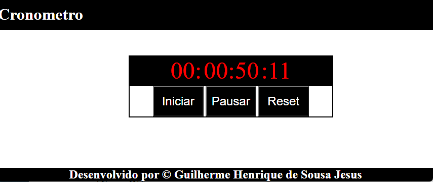

# CronometroJS
Cronômetro Básico JavaScript

## Motivo do projeto

    Efetuar um aplicativo básico para treinar habilidades adquiridas em JavaScript.

## Imagem

 
 
## Lógica Cronônometro

Será efetuado a somatoria das variaveis adicionando mais um, fazendo assim o cronômetro
efetuar um efeito crescente nos valores, quando a variavel chegar ao numero total estipulado
(60 para milisegundos, segundos e minutos, e 12 para horas), sua variavel irá zerar e efetuar,
novamente a conta adicionando.

## Dificuldades

    O projeto por ser criado em JavaScript não foi encontrado muitas dificuldades além de escolher
a melhor função para ser determindada essa somatória das variaveis de tempo em tempo, foi escolhida
a função nativa do javaScript setInterval e clearInterval devido aos seus beneficios e encaixe no 
projeto.
